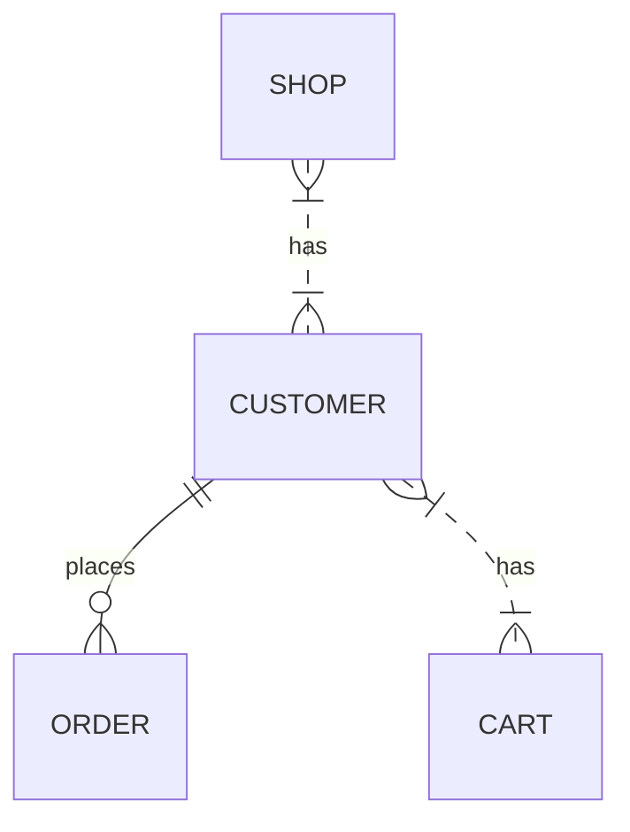

---
config:
  look: handDrawn
  theme: neutral
---
# learning_python
Guess what...

```mermaid
erDiagram
          SHOP }|..|{ CUSTOMER : has
          CUSTOMER ||--o{ ORDER : places
          CUSTOMER }|..|{ CART : has
```
